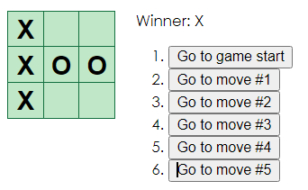

# React-tutorial
I followed [React's Tutorial](https://ja.reactjs.org/tutorial/tutorial.html) and made tit-tat-toe game.

# Description
Players can play tit-tat-toe game.
It can display when the game is settled
History is saved as the game progresses.
Reviewing the history of moves and referring to the previous state of the board.

# DEMO

https://user-images.githubusercontent.com/82300582/166613679-ba3e6fdf-4cca-4eb4-83ef-341ff4c9196a.mp4

# Usage
1. React
2. Node.js
3. css
4. JavaScript

# Editor
VScode
